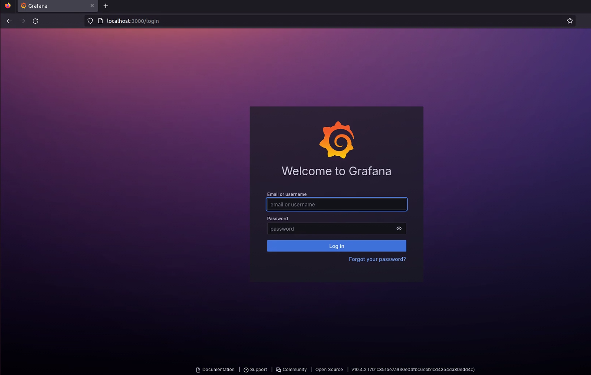
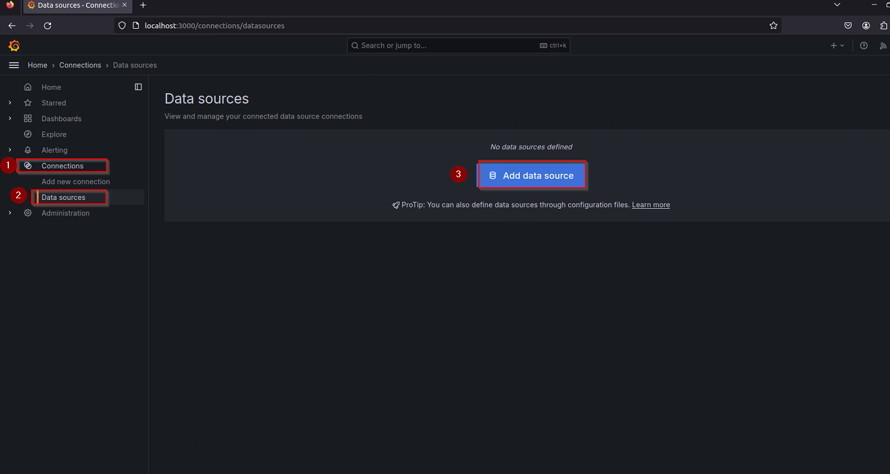
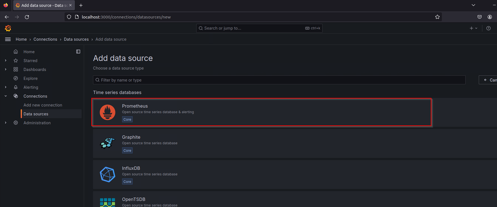
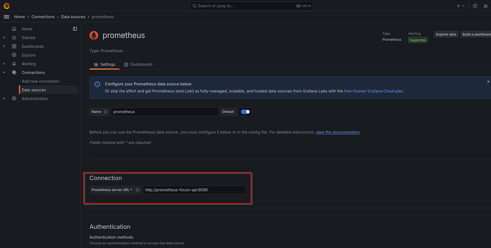
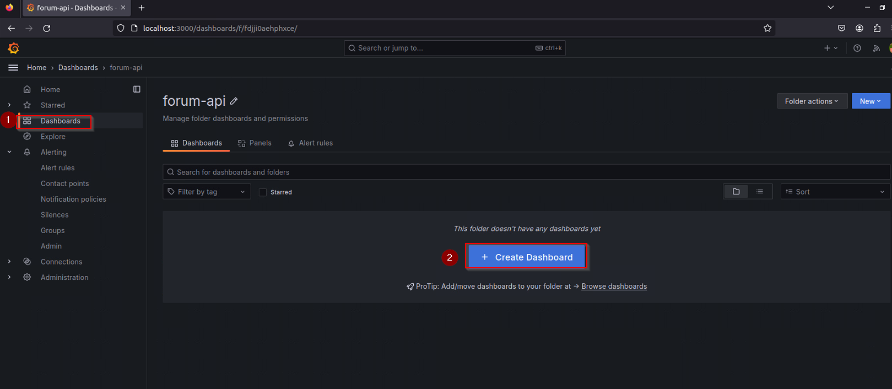
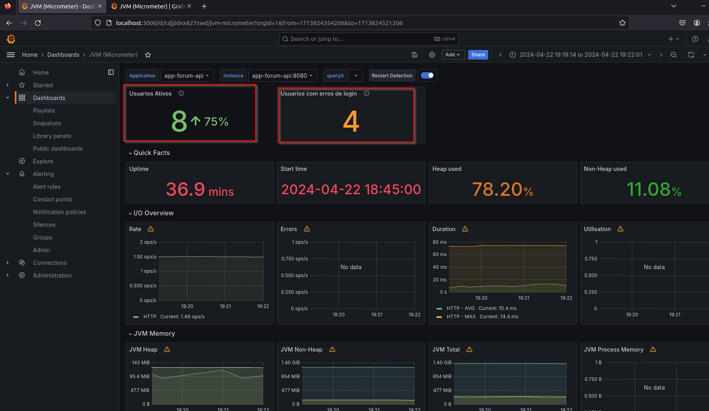

# Grafana - Integrando o Grafana com o Prometheus


**Objetivo**:

O objetivo deste projeto é configurar e integrar o Grafana com o Prometheus para estabelecer um sistema de monitoramento eficiente e visualização de métricas. Ao unir essas duas ferramentas poderosas, buscamos alcançar os seguintes objetivos:

1.Monitoramento Abrangente
2.Visualização de Dados:
3.Identificação de Problemas:
4.Tomada de Decisão Informada:
5.Melhoria Contínua:

## 📌 Requisitos

* [Projeto Anterior](https://github.com/Hooligam/Monitoramento-Prometheus)

* Ambiente de Desenvolvimento Integrado (IDE):Recomenda-se o uso do Eclipse devido à sua integração nativa com o Maven, o que simplifica o processo de gerenciamento de dependências.

* Docker e Docker-Compose: Essas ferramentas fornecem uma maneira consistente e eficiente de empacotar, distribuir e executar a aplicação em diferentes ambientes.

* Java JDK 1.8.0_312: O ambiente de desenvolvimento requer o Java Development Kit (JDK) versão 1.8.0_312 ou superior. Esta versão específica do JDK foi selecionada devido à compatibilidade com as dependências e bibliotecas utilizadas no projeto.

* Maven: O Maven é uma ferramenta de automação de compilação amplamente utilizada no ecossistema Java. Ele é usado para gerenciar dependências, compilar o código-fonte, executar testes e criar artefatos de distribuição da aplicação. É fundamental que o Maven esteja instalado e configurado corretamente no ambiente de desenvolvimento.


## 📦 Documentação

**Adicionar container Grafana no Docker Compose**

Vamos precisar subir um container do Grafana, para isso vamos adicionar o seguinte codigo no "docker-compose.yaml"

```
grafana-forum-api:
    image: grafana/grafana
    container_name: grafana-forum-api
    volumes:
      - ./grafana:/var/lib/grafana
    restart: unless-stopped
    ports:
      - 3000:3000
    networks:
      - monit
    depends_on:
      - prometheus-forum-api
    user: root
```
**Subindo os containers**

Rode o seguinte comando para subir todos os containers do projeto.

```
docker-compose up -d
```
**Testando**

Para verificar se tudo ocorreu como esperado, vamos acessar o Grafana que se encontra em localhost:3000



O primeiro acesso no Grafana e feito com as seguintes informações no usuario e senha: admin:admin

**Configurar Data Source**

Apos conseguir logar no Grafana, precisamos configurar nosso Data Source, que seria a nossa fonte de dados.

* Vá para a seção "Configuration" -> "Data Sources" no Grafana



* Selecione o "Prometheus" como origem de dados 



**Configure a conexão**

Certificando-se de apontar para o container Prometheus e não para o localhost



**Criar Dashboards**

Agora que o Data Source está configurado, vá para a seção "Dashboards" e comece a criar.

É recomendado criar uma pasta para organizar os Dashboards.




**🔥 Conclusão 🔥**

Após completarmos todas as configurações necessárias, o Grafana vai estar integrado ao Prometheus e ao nosso projeto. 

As possibilidades são infinitas, nesse caso eu optei por:

* Criei apenas 2 metricas personalizadas (Usuarios ativos e Usuarios com erro de login)

* Temos a possibilidade de importar Dashboards para otimizar a criação (com exeção das metricas personalizadas, o restante das metricas foi importada)




**Vamos utilizar esse projeto como base para desenvolver alertas e mais metricas personalizadas**

⌨️ com ❤️ por [Elias Assunção](https://github.com/Hooligam) 🔥

